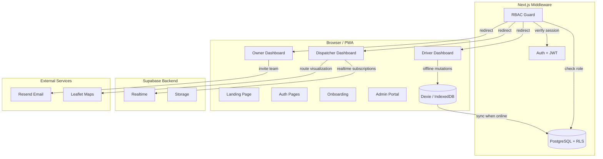

# BaseOps

> **Open-source, production-grade multi-tenant PWA for logistics and last-mile delivery.**

BaseOps is a full-stack starter that demonstrates every serious pattern a modern SaaS application needs — multi-tenancy with Row Level Security, role-based access control, offline-first operation with automatic sync, real-time updates, route mapping, and analytics dashboards — all within the logistics domain.

Any logistics company can sign up, onboard their fleet, and manage drivers, parcels, and routes from a single platform — even when drivers are offline in dead zones.


---

## Architecture



## Domain Model

| Entity | Description | Tenant Scoped |
|--------|-------------|:---:|
| **Organization** | The tenant — a logistics company | — |
| **Profile** | User linked to auth, assigned a role | ✓ |
| **Vehicle** | Fleet vehicle (motorcycle/van/truck) | ✓ |
| **Parcel** | Core operational unit with lifecycle | ✓ |
| **Route** | Planned delivery route for a driver | ✓ |
| **Delivery Event** | Immutable audit trail entry | ✓ |

**Parcel Lifecycle:** `Received → Assigned → In Transit → Delivered → Failed / Returned`

**Roles:** `Owner` · `Dispatcher` · `Driver`

## Tech Stack

| Layer | Technology | Purpose |
|-------|-----------|---------|
| Framework | Next.js 16 (App Router) | Server components, route groups, middleware |
| Styling | Tailwind CSS v4 + shadcn/ui | Command-center dark aesthetic |
| Database | Supabase (PostgreSQL) | Multi-tenant data with RLS |
| Auth | Supabase Auth | JWT sessions, magic links |
| Realtime | Supabase Realtime | Live parcel status updates |
| Offline | Dexie.js (IndexedDB) | Local mutation queue + sync |
| PWA | @ducanh2912/next-pwa | Service worker, app shell cache |
| Maps | Leaflet + react-leaflet | Open-source route visualization |
| Charts | Recharts | Analytics dashboards |
| Forms | react-hook-form + Zod | Typed validation schemas |
| Email | Resend | Team invitation emails |

## Project Structure

```
baseops/
├── src/
│   ├── app/
│   │   ├── (auth)/           ← Login, Register, Forgot Password
│   │   ├── (onboarding)/     ← 3-step org setup flow
│   │   ├── (dispatcher)/     ← Command center (owners + dispatchers)
│   │   ├── (driver)/         ← Mobile-first driver interface
│   │   ├── (owner)/          ← Org management + analytics
│   │   ├── (admin)/          ← Super-admin portal
│   │   ├── api/              ← Route handlers (invite, auth callback)
│   │   ├── layout.tsx        ← Root layout (dark theme, PWA meta)
│   │   └── page.tsx          ← Public landing page
│   ├── components/
│   │   ├── ui/               ← shadcn primitives (14 components)
│   │   └── shared/           ← Sidebars, theme provider
│   ├── lib/
│   │   ├── supabase/         ← Server, client, and middleware clients
│   │   ├── validations/      ← All Zod schemas
│   │   ├── db.ts             ← Dexie IndexedDB schema
│   │   ├── sync-engine.ts    ← Offline queue + auto-sync
│   │   └── utils.ts          ← Tailwind merge utility
│   ├── types/
│   │   └── index.ts          ← All TypeScript interfaces
│   └── middleware.ts          ← RBAC route guard
├── supabase/
│   ├── migrations/           ← Schema + RLS policies
│   └── seed.sql              ← Demo data (Nairobi logistics)
├── public/
│   └── manifest.json         ← PWA manifest
├── .env.example
├── next.config.ts            ← PWA + Turbopack config
└── package.json
```

## Getting Started

### Prerequisites

- Node.js 18+
- A [Supabase](https://supabase.com) project (free tier works)
- (Optional) A [Resend](https://resend.com) API key for email invitations

### 1. Clone and Install

```bash
git clone https://github.com/your-username/baseops.git
cd baseops
npm install
```

### 2. Configure Environment

```bash
cp .env.example .env.local
```

Edit `.env.local` with your Supabase project URL, anon key, and service role key. You can find these in your Supabase dashboard under **Settings → API**.

### 3. Set Up the Database

Run the migration in your Supabase SQL Editor or via the CLI:

```bash
# Option A: Copy-paste supabase/migrations/00001_initial_schema.sql into the SQL Editor

# Option B: Use the Supabase CLI
npx supabase db push
```

Then seed the demo data:

```bash
# Copy-paste supabase/seed.sql into the SQL Editor
```

### 4. Run Locally

```bash
npm run dev
```

Open [http://localhost:3000](http://localhost:3000).

## Key Architectural Patterns

### Multi-Tenancy with RLS

Every table has an `org_id` column. Row Level Security policies use `auth.jwt()` to verify the requesting user belongs to the same organization:

```sql
CREATE POLICY "org_members_can_read_parcels" ON public.parcels
  FOR SELECT USING (
    org_id IN (
      SELECT org_id FROM public.profiles WHERE id = auth.uid()
    )
  );
```

### RBAC Middleware

The middleware intercepts every request and performs four operations:
1. Refreshes the Supabase session
2. Reads the user's role from their profile
3. Redirects to the correct dashboard if accessing the wrong route group
4. Forces incomplete onboarding back to `/onboarding`

### Offline-First Sync Engine

```
Driver taps "Delivered"
    → Write to Dexie (instant UI update)
    → Add to sync_queue (status: pending)
    → [When online] → Flush to Supabase (FIFO order)
    → Mark as synced / retry up to 3x / mark as failed
```

The sync indicator shows: 🟢 Online · 🟡 Syncing · 🔴 Offline (X pending)

### Auto-Generated Tracking Codes

Parcels automatically receive tracking codes in the format `BOP-YYYY-XXXXX` via a database trigger, ensuring uniqueness per organization per year.

## Dashboard Preview

BaseOps features a premium, high-density dark aesthetic designed for operational clarity.

- **Dispatcher Command Center:** Stats bar, real-time map, and Kanban parcel board.
- **Owner Analytics:** Recharts-powered data visualization for delivery volume and fleet performance.
- **Driver Mobile App:** Offline-first task management with background sync (IndexedDB).
- **Validation Pipeline:** Robust multi-step forms with strict Zod enforcement.
- **RBAC Middleware:** Secure Next.js route protection with Supabase Row Level Security.

---

## Roadmap

- [x] **Phase 1** — Foundation (Auth, RBAC, Schema, Middleware)
- [x] **Phase 2** — Onboarding + Layout Shells
- [x] **Phase 3** — Dispatcher Board (Kanban, Leaflet, Realtime)
- [x] **Phase 4** — Driver Interface + Offline Sync
- [x] **Phase 5** — Owner Analytics + Team Management
- [x] **Phase 6** — Polish + Deployment

## License

MIT — use this as a foundation for your own multi-tenant applications.
