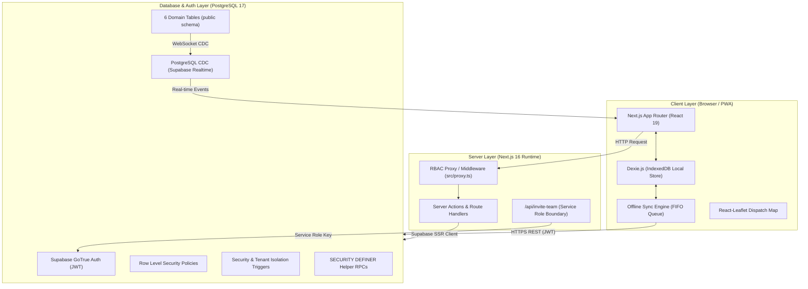
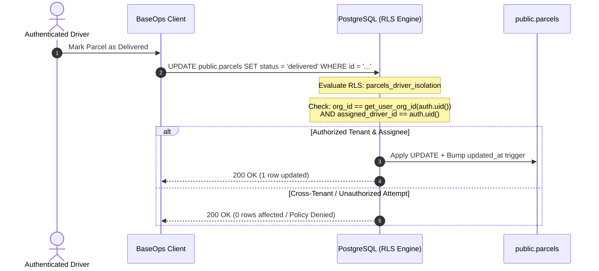
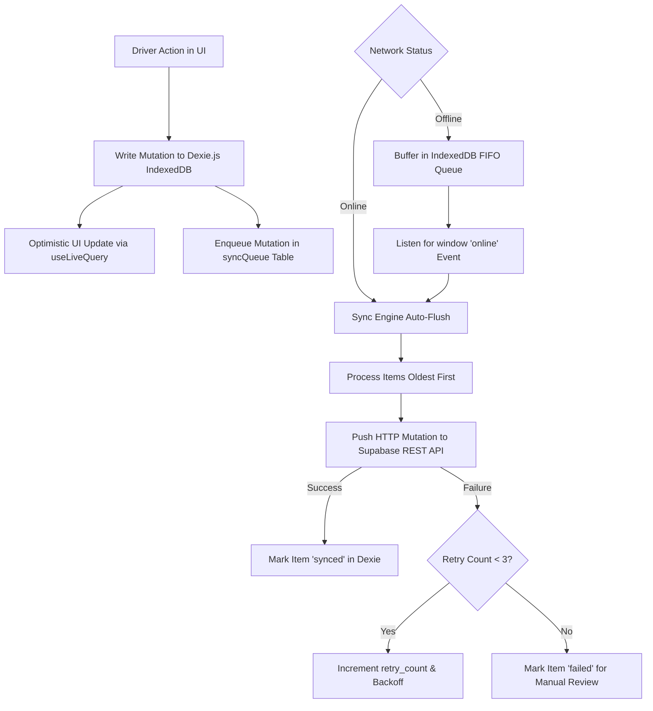
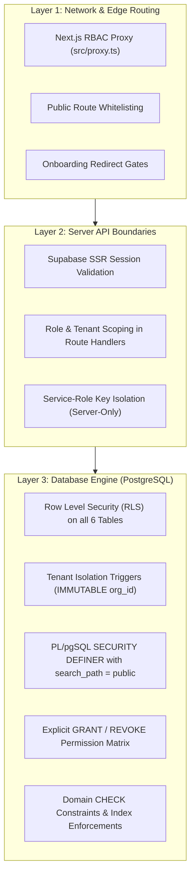

# BaseOps System Architecture

BaseOps is a multi-tenant, offline-first Logistics and Fleet Management Progressive Web Application (PWA) built with Next.js 16, Supabase, and PostgreSQL.

This document describes the architectural topology, multi-tenancy model, offline synchronization pipeline, security boundaries, and data flow of the application.

---

## 1. High-Level System Topology



---

## 2. Multi-Tenancy Architecture

BaseOps utilizes a **Shared Database, Shared Schema, Row-Level Isolation** multi-tenancy model:

1. **Tenant Identification**: Every operational record (`parcels`, `vehicles`, `routes`, `delivery_events`) and user profile (`profiles`) contains an `org_id UUID REFERENCES public.organizations(id)`.
2. **Context Resolution**: The authenticated user's identity (`auth.uid()`) maps to a unique row in `public.profiles`. The database extracts the user's `org_id` and `role` via hardened helper functions.
3. **Database Enforcement**: Multi-tenancy is enforced at the database engine level via PostgreSQL Row Level Security (RLS) policies and `BEFORE UPDATE / INSERT` triggers. Client-side filters are treated as UI conveniences, never security boundaries.
4. **Tenant Immutability**: Critical entity ownership (`org_id` on parcels, vehicles, routes, and profiles) is protected by database triggers that reject any attempt to reassign records across tenant boundaries.



---

## 3. Role-Based Access Control (RBAC) Model

BaseOps implements three distinct user roles within each tenant organization, plus a platform Super-Admin:

| Role | Primary Interface | Allowed Capabilities | Restricted Capabilities |
| :--- | :--- | :--- | :--- |
| **`owner`** | `/owner/*` & `/dispatch/*` | Full organization governance, billing plan selection, team member invitation (all roles), parcel & fleet management, executive analytics. | Cannot modify own `role` or `org_id` directly via client UPDATE (must use administrative RPCs). |
| **`dispatcher`** | `/dispatch/*` | Real-time parcel board (Kanban), parcel creation & assignment, fleet registration, route inspection, driver invitation. | Cannot invite owners/dispatchers, cannot alter organization billing or core settings, cannot access `/owner/*`. |
| **`driver`** | `/driver` | Mobile-first task list, offline parcel status updates (`delivered`, `failed`), offline audit trail creation, local IndexedDB caching. | Cannot view or mutate other drivers' parcels, cannot register vehicles, cannot access dispatch or owner dashboards. |
| **Super-Admin** | `/admin` | Platform-wide organization directory, subscription tier overrides, tenant wallet credit adjustments. | Access gated strictly by matching `SUPER_ADMIN_EMAIL` environment variable. |

---

## 4. Offline-First Synchronization Engine

The driver mobile application is designed to operate seamlessly in cellular dead zones and unreliable network conditions.



### Key Offline Engine Properties:
1. **Single Source of Truth**: The driver UI binds directly to Dexie.js using `useLiveQuery()`. UI state updates instantaneously on user interaction without waiting for network responses.
2. **FIFO Processing**: Mutations are queued with timestamps and executed sequentially to preserve state transition order (e.g. `picked_up` $\rightarrow$ `in_transit` $\rightarrow$ `delivered`).
3. **Non-Destructive Pulls**: Server state synchronization (`pullAssignedParcels`) explicitly checks `syncQueue` and excludes locally modified parcels from being overwritten by stale server snapshots.
4. **Data Leakage Prevention**: On user logout or session expiration, `clearLocalDatabase()` immediately wipes all cached parcels, routes, and queue entries from IndexedDB.

---

## 5. Security Architecture & Defense-in-Depth



1. **Edge Route Protection (`src/proxy.ts`)**: Intercepts all incoming requests, refreshes JWT cookies, verifies onboarding completion, and redirects unauthorized role requests before rendering page components.
2. **Server-Side API Boundaries (`src/app/api/*`)**: Server route handlers never trust client-supplied tenant identifiers; caller context is resolved exclusively from validated session cookies.
3. **Database Security Layer**: Even if client application logic is bypassed, PostgreSQL RLS policies, check constraints, and triggers guarantee that cross-tenant access is structurally impossible.

---

## 6. Directory Structure & Code Organization

```text
baseops/
├── .env.example              # Production-grade environment configuration template
├── package.json              # Dependencies and test runner scripts
├── next.config.ts            # Next.js 16 configuration with PWA integration
├── tsconfig.json             # Strict TypeScript configuration
├── scripts/
│   └── seed-users.js         # Administrative seed script for Supabase auth accounts
├── src/
│   ├── app/                  # Next.js 16 App Router
│   │   ├── (admin)/          # Super-admin platform controls (/admin)
│   │   ├── (auth)/           # Authentication flows (login, register, forgot-password)
│   │   ├── (dispatcher)/     # Dispatch center, parcels, fleet, drivers, routes
│   │   ├── (driver)/         # Mobile-first driver delivery app with offline sync
│   │   ├── (onboarding)/     # Organization & initial fleet onboarding wizard
│   │   ├── (owner)/          # Executive dashboard, team management, billing, org settings
│   │   ├── api/              # Secure API route handlers (auth callbacks, invite-team)
│   │   ├── globals.css       # Tailwind CSS v4 styling & dark theme variables
│   │   ├── layout.tsx        # Root HTML shell & ThemeProvider
│   │   └── page.tsx          # Public product landing page
│   ├── components/           # Modular React components (dispatch, driver, owner, shared, ui)
│   ├── lib/                  # Core utilities, Dexie database, Supabase clients, sync engine
│   ├── proxy.ts              # Next.js 16 RBAC routing proxy / session middleware
│   └── types/                # Authoritative TypeScript domain entity interfaces
├── supabase/
│   ├── config.toml           # Local Supabase CLI configuration
│   ├── seed.sql              # Deterministic database seed data
│   └── migrations/           # Authoritative SQL migration history (00001 -> 00004)
├── tests/
│   └── security/             # Automated security, RLS, offline storage, and live DB tests
└── docs/                     # Technical, operational, and architectural documentation
```
