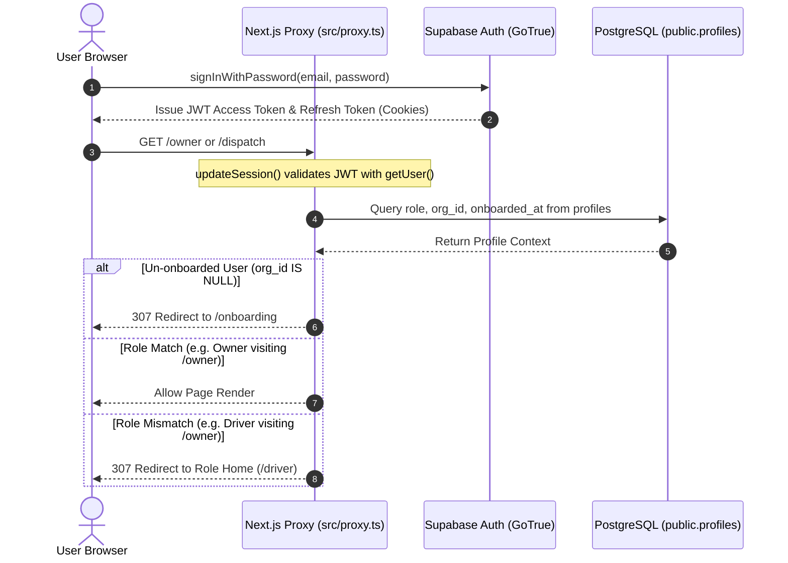

# BaseOps Authentication & Session Lifecycle Specification

This document details the authentication flows, session handling, cookie management, role resolution, and security gates in BaseOps.

---

## 1. Authentication Architecture Overview

BaseOps uses **Supabase Auth (GoTrue)** integrated with Next.js 16 App Router via `@supabase/ssr`.

---

## 2. Session Management & Cookie Architecture

BaseOps maintains user sessions server-side using secure HTTP cookies managed through `@supabase/ssr`.

### 2.1 Why `getUser()` is Required (Not `getSession()`):
- `supabase.auth.getSession()` merely decodes the JWT token from the incoming cookie without validating its cryptographic signature or revocation status against the Supabase Auth server.
- `supabase.auth.getUser()` makes a verified network call to GoTrue, validating that the token is currently active and has not been revoked. BaseOps strictly enforces `getUser()` inside `src/lib/supabase/middleware.ts` and API routes.

### 2.2 Token Storage:
- Authentication tokens are written to browser cookies and refreshed automatically by the Next.js routing proxy on every request.
- No access tokens or refresh tokens are ever stored in `localStorage` or `sessionStorage`.

---

## 3. User Flows

### 3.1 Self-Registration Flow (`/register`)
1. User submits `full_name`, `email`, and `password`.
2. Browser calls `supabase.auth.signUp()` with metadata `{ full_name, role: 'owner' }`.
3. The database trigger `on_auth_user_created` creates an initial record in `public.profiles` with `org_id = NULL` and `onboarded_at = NULL`.
4. User is redirected to `/onboarding`.

### 3.2 Atomic Onboarding Flow (`/onboarding`)
To prevent unassigned users from arbitrarily assigning themselves to existing organizations (SEC-07), onboarding is executed via a trusted database RPC:
1. User provides Organization Name and URL Slug.
2. Client calls `supabase.rpc('create_organization_and_owner', { org_name, org_slug })`.
3. The `SECURITY DEFINER` function atomically:
   - Verifies caller has no existing organization.
   - Inserts new row in `public.organizations`.
   - Binds `org_id` and sets `role = 'owner'` on the caller's profile.
4. User registers their first vehicle and is redirected to `/dispatch`.

### 3.3 Sign-In Flow (`/login`)
1. User enters email and password.
2. `supabase.auth.signInWithPassword()` authenticates the session.
3. Client inspects profile and redirects to the appropriate role home:
   - **`owner`** $\rightarrow$ `/owner`
   - **`dispatcher`** $\rightarrow$ `/dispatch`
   - **`driver`** $\rightarrow$ `/driver`
   - Incomplete Onboarding $\rightarrow$ `/onboarding`

### 3.4 Team Member Invitation Flow (`/api/invite-team`)
1. An authenticated owner or dispatcher invites a team member by email.
2. Server API handler (`POST /api/invite-team`):
   - Authenticates inviter session and retrieves trusted `org_id`.
   - Validates role permissions (dispatchers can only invite drivers).
   - Uses Supabase Admin Client (`SUPABASE_SERVICE_ROLE_KEY`) to create the auth account.
   - Upserts profile with target `org_id`, `role`, and `onboarded_at = now()`.
   - Generates magic link token and sends invitation email via Resend.
3. When the invitee clicks the link, `/api/auth/confirm` verifies the token hash and opens their dashboard directly, bypassing onboarding.

### 3.5 Sign-Out & Cross-Account Cleanup Flow
1. User clicks **Sign Out**.
2. `clearLocalDatabase()` immediately purges all cached parcels, routes, and queue entries from IndexedDB.
3. `supabase.auth.signOut()` invalidates the session and deletes auth cookies.
4. User is redirected to `/login`.

---

## 4. Route Authorization Mapping

Enforced by `src/proxy.ts`:

| Route Prefix | Permitted Roles | Unauthorized Behavior |
| :--- | :--- | :--- |
| **`/owner`** | `owner` | Redirects to role home (`/dispatch` or `/driver`) |
| **`/dispatch`** | `owner`, `dispatcher` | Redirects to role home (`/driver`) |
| **`/driver`** | `driver` | Redirects to role home (`/dispatch` or `/owner`) |
| **`/admin`** | Super-Admin only | Validates `user.email === SUPER_ADMIN_EMAIL`; redirects if mismatch |
| **`/onboarding`**| Users with `org_id IS NULL` | Redirects onboarded users to role home |
| **Public Routes**| Everyone (`/`, `/login`, `/register`, `/forgot-password`)| Allowed without authentication |
