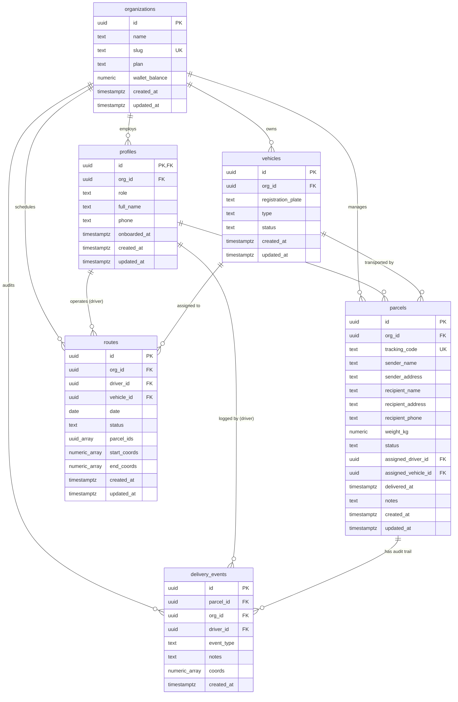

# BaseOps Database Architecture & Schema Specification

This document provides the authoritative technical reference for the BaseOps PostgreSQL database schema, migrations, constraints, triggers, functions, and indexing strategy.

---

## 1. Entity-Relationship Diagram (ERD)



---

## 2. Table Specifications & Data Dictionary

### 2.1 `public.organizations`
Tenant organization entity representing logistics providers or fleet operations.

| Column | Type | Constraints | Description |
| :--- | :--- | :--- | :--- |
| `id` | `UUID` | `PRIMARY KEY DEFAULT gen_random_uuid()` | Unique organization identifier. |
| `name` | `TEXT` | `NOT NULL` | Legal / commercial name of company. |
| `slug` | `TEXT` | `UNIQUE NOT NULL` | URL-safe identifier (e.g. `quickship`). |
| `plan` | `TEXT` | `NOT NULL DEFAULT 'free' CHECK (plan IN ('free', 'pro'))` | Subscription tier. |
| `wallet_balance` | `NUMERIC(10,2)` | `NOT NULL DEFAULT 0.00 CHECK (wallet_balance >= 0.00)` | Prepaid balance for platform add-ons. |
| `created_at` | `TIMESTAMPTZ` | `NOT NULL DEFAULT now()` | Timestamp of creation. |
| `updated_at` | `TIMESTAMPTZ` | `NOT NULL DEFAULT now()` | Automatically bumped by trigger. |

### 2.2 `public.profiles`
User profile linked 1:1 with Supabase Auth (`auth.users`).

| Column | Type | Constraints | Description |
| :--- | :--- | :--- | :--- |
| `id` | `UUID` | `PRIMARY KEY REFERENCES auth.users(id) ON DELETE CASCADE` | Matches Supabase Auth user ID. |
| `org_id` | `UUID` | `REFERENCES public.organizations(id) ON DELETE CASCADE` | Associated tenant (NULL before onboarding). |
| `role` | `TEXT` | `NOT NULL DEFAULT 'driver' CHECK (role IN ('owner', 'dispatcher', 'driver'))` | RBAC role. |
| `full_name` | `TEXT` | `NULLABLE` | Display name of the user. |
| `phone` | `TEXT` | `NULLABLE` | Contact phone number. |
| `onboarded_at` | `TIMESTAMPTZ` | `NULLABLE` | Timestamp when user finished onboarding. |
| `created_at` | `TIMESTAMPTZ` | `NOT NULL DEFAULT now()` | Account creation timestamp. |
| `updated_at` | `TIMESTAMPTZ` | `NOT NULL DEFAULT now()` | Automatically bumped by trigger. |

### 2.3 `public.vehicles`
Fleet vehicles registered under an organization.

| Column | Type | Constraints | Description |
| :--- | :--- | :--- | :--- |
| `id` | `UUID` | `PRIMARY KEY DEFAULT gen_random_uuid()` | Unique vehicle identifier. |
| `org_id` | `UUID` | `NOT NULL REFERENCES public.organizations(id) ON DELETE CASCADE` | Tenant owner. |
| `registration_plate` | `TEXT` | `NOT NULL` | License plate (e.g. `KDA 123A`). |
| `type` | `TEXT` | `NOT NULL DEFAULT 'van' CHECK (type IN ('motorcycle', 'van', 'truck'))` | Vehicle category. |
| `status` | `TEXT` | `NOT NULL DEFAULT 'available' CHECK (status IN ('available', 'on_route', 'maintenance'))` | Operational state. |
| `created_at` | `TIMESTAMPTZ` | `NOT NULL DEFAULT now()` | Registration timestamp. |
| `updated_at` | `TIMESTAMPTZ` | `NOT NULL DEFAULT now()` | Automatically bumped by trigger. |
| *Composite* | *Unique* | `UNIQUE (org_id, registration_plate)` | Prevents duplicate plates within tenant. |

### 2.4 `public.parcels`
Individual delivery items managed by the tenant.

| Column | Type | Constraints | Description |
| :--- | :--- | :--- | :--- |
| `id` | `UUID` | `PRIMARY KEY DEFAULT gen_random_uuid()` | Unique parcel identifier. |
| `org_id` | `UUID` | `NOT NULL REFERENCES public.organizations(id) ON DELETE CASCADE` | Tenant owner. |
| `tracking_code` | `TEXT` | `UNIQUE NOT NULL DEFAULT 'BOP-' \|\| ...` | Public tracking reference. |
| `sender_name` | `TEXT` | `NOT NULL` | Origin sender name. |
| `sender_address` | `TEXT` | `NOT NULL` | Origin pickup location. |
| `recipient_name` | `TEXT` | `NOT NULL` | Destination recipient name. |
| `recipient_address` | `TEXT` | `NOT NULL` | Destination delivery address. |
| `recipient_phone` | `TEXT` | `NOT NULL` | Recipient contact phone. |
| `weight_kg` | `NUMERIC(6,2)` | `NOT NULL DEFAULT 1.0 CHECK (weight_kg > 0 AND weight_kg <= 10000)` | Item weight in kg. |
| `status` | `TEXT` | `NOT NULL DEFAULT 'received' CHECK (status IN ('received', 'assigned', 'in_transit', 'delivered', 'failed', 'returned'))` | Lifecycle state. |
| `assigned_driver_id`| `UUID` | `NULLABLE REFERENCES public.profiles(id) ON DELETE SET NULL` | Driver assigned to parcel. |
| `assigned_vehicle_id`| `UUID` | `NULLABLE REFERENCES public.vehicles(id) ON DELETE SET NULL` | Vehicle assigned to parcel. |
| `delivered_at` | `TIMESTAMPTZ` | `NULLABLE` | Completion timestamp. |
| `notes` | `TEXT` | `NULLABLE` | Special handling instructions. |
| `created_at` | `TIMESTAMPTZ` | `NOT NULL DEFAULT now()` | Creation timestamp. |
| `updated_at` | `TIMESTAMPTZ` | `NOT NULL DEFAULT now()` | Automatically bumped by trigger. |
| *Check* | *Constraint* | `CHECK (delivered_at IS NULL OR delivered_at >= created_at)` | Chronological delivery validation. |

### 2.5 `public.delivery_events`
Immutable append-only audit trail logging delivery lifecycle milestones and GPS telemetry.

| Column | Type | Constraints | Description |
| :--- | :--- | :--- | :--- |
| `id` | `UUID` | `PRIMARY KEY DEFAULT gen_random_uuid()` | Unique audit event ID. |
| `parcel_id` | `UUID` | `NOT NULL REFERENCES public.parcels(id) ON DELETE CASCADE` | Associated parcel. |
| `org_id` | `UUID` | `NOT NULL REFERENCES public.organizations(id) ON DELETE CASCADE` | Associated tenant. |
| `driver_id` | `UUID` | `NULLABLE REFERENCES public.profiles(id) ON DELETE SET NULL` | Driver logging the event. |
| `event_type` | `TEXT` | `NOT NULL CHECK (event_type IN ('received', 'assigned', 'picked_up', 'attempted', 'delivered', 'failed', 'returned'))` | Milestone type. |
| `notes` | `TEXT` | `NULLABLE` | Driver remarks or failure reasons. |
| `coords` | `NUMERIC[]` | `NULLABLE` | GPS coordinates `[latitude, longitude]`. |
| `created_at` | `TIMESTAMPTZ` | `NOT NULL DEFAULT now()` | Event log timestamp. |

> **Immutability Policy**: `UPDATE` and `DELETE` operations are permanently rejected via RLS (`USING (false)`), making this table a tamper-proof ledger.

### 2.6 `public.routes`
Daily delivery routes bundling multiple parcels to a specific driver and vehicle.

| Column | Type | Constraints | Description |
| :--- | :--- | :--- | :--- |
| `id` | `UUID` | `PRIMARY KEY DEFAULT gen_random_uuid()` | Unique route identifier. |
| `org_id` | `UUID` | `NOT NULL REFERENCES public.organizations(id) ON DELETE CASCADE` | Tenant owner. |
| `driver_id` | `UUID` | `NOT NULL REFERENCES public.profiles(id) ON DELETE CASCADE` | Driver assigned to route. |
| `vehicle_id` | `UUID` | `NOT NULL REFERENCES public.vehicles(id) ON DELETE CASCADE` | Vehicle used on route. |
| `date` | `DATE` | `NOT NULL DEFAULT CURRENT_DATE` | Operational date of route. |
| `status` | `TEXT` | `NOT NULL DEFAULT 'planned' CHECK (status IN ('planned', 'active', 'completed'))` | Execution state. |
| `parcel_ids` | `UUID[]` | `NOT NULL DEFAULT '{}'` | Array of parcel IDs on route. |
| `start_coords` | `NUMERIC[]` | `NULLABLE` | Origin depot GPS coordinates. |
| `end_coords` | `NUMERIC[]` | `NULLABLE` | Destination depot GPS coordinates. |
| `created_at` | `TIMESTAMPTZ` | `NOT NULL DEFAULT now()` | Creation timestamp. |
| `updated_at` | `TIMESTAMPTZ` | `NOT NULL DEFAULT now()` | Automatically bumped by trigger. |

---

## 3. Migration History

The schema is built chronologically from these four migrations:

| Migration File | Primary Responsibilities |
| :--- | :--- |
| [`00001_initial_schema.sql`](file:///c:/dev/Multi-tenancy/baseops/supabase/migrations/00001_initial_schema.sql) | Creates all 6 core tables, basic constraints, automatic profile creation trigger on `auth.users`, and initial RLS policies. |
| [`00002_p0_security_remediation.sql`](file:///c:/dev/Multi-tenancy/baseops/supabase/migrations/00002_p0_security_remediation.sql) | Hardens parcel update policies, restricts driver mutation scope to assigned parcels, and introduces tenant protection triggers. |
| [`00003_p0_security_reverification.sql`](file:///c:/dev/Multi-tenancy/baseops/supabase/migrations/00003_p0_security_reverification.sql) | Hardens helper functions (`get_user_org_id`, `get_user_role`) as `PL/pgSQL SECURITY DEFINER` with explicit `search_path = public, pg_temp`; prevents RLS recursive subquery errors; implements atomic `create_organization_and_owner` RPC. |
| [`00004_p1_database_architecture_hardening.sql`](file:///c:/dev/Multi-tenancy/baseops/supabase/migrations/00004_p1_database_architecture_hardening.sql) | Adds 17 performance indexes, check constraints (`chk_organizations_wallet_balance_positive`, `chk_parcels_weight_range`, `chk_parcels_delivery_time_order`, `uq_vehicles_org_plate`), route tenant protection trigger, and automated `updated_at` triggers. |

---

## 4. Security Triggers & Functions

### 4.1 Security Triggers
- **`trg_protect_profile_role_and_org`**: Enforces that standard users cannot alter their own `role` or `org_id` directly via SQL `UPDATE`. Prevents privilege escalation and tenant hijacking.
- **`trg_protect_parcel_tenant_isolation`**: Enforces that a parcel's `org_id` cannot be reassigned once created.
- **`trg_protect_vehicle_tenant_isolation`**: Enforces that a vehicle's `org_id` cannot be reassigned across organizations.
- **`trg_protect_route_tenant_isolation`**: Enforces that a route's `org_id` cannot be modified after creation.

### 4.2 Utility Triggers
- **`trg_*_updated_at`**: Attached to `organizations`, `profiles`, `vehicles`, `parcels`, and `routes` to automatically set `updated_at = now()` upon any `UPDATE`.

### 4.3 Hardened PL/pgSQL Functions
All functions are configured with explicit `SET search_path = public, pg_temp` to prevent search_path injection:

```sql
-- Resolves caller's tenant ID
CREATE OR REPLACE FUNCTION public.get_user_org_id(user_id UUID)
RETURNS UUID
LANGUAGE plpgsql
SECURITY DEFINER
SET search_path = public, pg_temp
AS $$
DECLARE
    v_org_id UUID;
BEGIN
    SELECT org_id INTO v_org_id
    FROM public.profiles
    WHERE id = user_id;
    RETURN v_org_id;
END;
$$;

-- Atomic Onboarding RPC
CREATE OR REPLACE FUNCTION public.create_organization_and_owner(
    org_name TEXT,
    org_slug TEXT
)
RETURNS UUID
LANGUAGE plpgsql
SECURITY DEFINER
SET search_path = public, pg_temp
AS $$
...
$$;
```

---

## 5. Performance Indexing Matrix

| Index Name | Table | Columns / Conditions | Target Workload / Policy |
| :--- | :--- | :--- | :--- |
| `idx_profiles_org_id` | `profiles` | `(org_id)` | Tenant user lookups & team table |
| `idx_profiles_org_role` | `profiles` | `(org_id, role)` | Dispatcher / driver workforce queries |
| `idx_vehicles_org_id` | `vehicles` | `(org_id)` | Fleet listing by tenant |
| `idx_vehicles_org_status` | `vehicles` | `(org_id, status)` | Active fleet metric calculation |
| `idx_parcels_org_id` | `parcels` | `(org_id)` | RLS tenant isolation evaluation |
| `idx_parcels_driver_id` | `parcels` | `(assigned_driver_id)` | Driver task assignment queries |
| `idx_parcels_vehicle_id` | `parcels` | `(assigned_vehicle_id)` | Vehicle workload join lookups |
| `idx_parcels_org_driver_status` | `parcels` | `(org_id, assigned_driver_id, status)` | Driver active workload filtering |
| `idx_parcels_org_created_at` | `parcels` | `(org_id, created_at DESC)` | Dispatch parcel list pagination |
| `idx_routes_org_id` | `routes` | `(org_id)` | Tenant route listing |
| `idx_routes_driver_id` | `routes` | `(driver_id)` | Driver daily route queries |
| `idx_routes_vehicle_id` | `routes` | `(vehicle_id)` | Vehicle schedule lookups |
| `idx_routes_org_date` | `routes` | `(org_id, date DESC)` | Dispatch route calendar lookup |
| `idx_delivery_events_parcel_id` | `delivery_events` | `(parcel_id)` | Parcel audit trail timeline |
| `idx_delivery_events_org_id` | `delivery_events` | `(org_id)` | Tenant audit log evaluation |
| `idx_delivery_events_driver_id` | `delivery_events` | `(driver_id)` | Driver coordinate history queries |
| `idx_delivery_events_parcel_created`| `delivery_events` | `(parcel_id, created_at ASC)` | Chronological milestone replay |

---

## 6. Migration vs. Seed Data Lifecycle

- **Migrations (`supabase/migrations/*.sql`)**: Authoritative database structural definition (tables, constraints, triggers, functions, RLS). Migrations run in production and local environments.
- **Seed Data (`supabase/seed.sql` / `scripts/seed-users.js`)**: Synthetic development records (test users, sample parcels, demo fleet). Seed data runs **exclusively in local development** via `supabase db reset` or `npm run seed`. **Never deploy development seed data to Supabase Cloud.**
