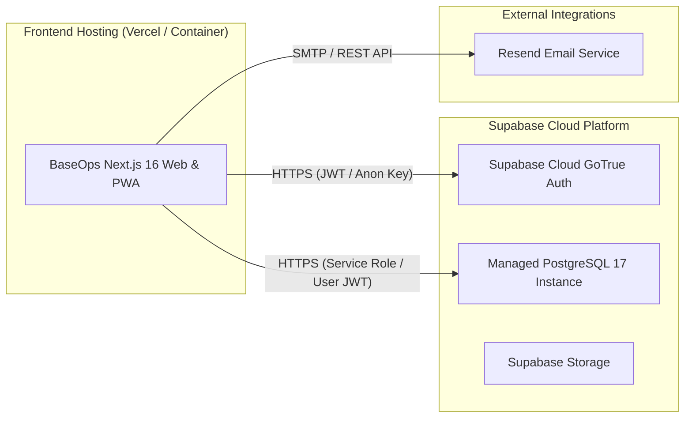

# BaseOps Production Deployment Guide

This guide provides the authoritative, step-by-step procedure for deploying BaseOps to **Supabase Cloud** (database & authentication) and **Vercel / Node.js** (frontend application).

---

## 1. Overview of Deployment Architecture



---

## 2. Phase 1: Supabase Cloud Database & Auth Setup

### Step 1: Create a Supabase Cloud Project
1. Log in to the [Supabase Cloud Dashboard](https://supabase.com/dashboard).
2. Click **New Project**.
3. Set your **Project Name** (e.g. `baseops-production`), database password, and choose your deployment region.
4. Note your **Project Reference ID** (found in the URL: `https://supabase.com/dashboard/project/<project-ref>`).

### Step 2: Authenticate Supabase CLI
```bash
npx supabase login
```
*This opens a browser window to generate an access token for the CLI.*

### Step 3: Link Local Repository to Cloud Project
```bash
npx supabase link --project-ref <your-project-ref>
```

### Step 4: Perform a Migration Dry-Run
```bash
npx supabase db push --dry-run
```
*Verify that migrations `00001` through `00004` are detected cleanly without conflicts.*

### Step 5: Deploy Migrations to Supabase Cloud
```bash
npx supabase db push
```
*This applies the complete schema, RLS policies, security triggers, check constraints, composite indexes, and hardened PL/pgSQL functions.*

> [!CAUTION]
> **DO NOT push development seed data to production.** `seed.sql` and `scripts/seed-users.js` contain demo test accounts and mock data meant solely for local development.

### Step 6: Configure Supabase Auth Redirect URLs
In the Supabase Cloud Dashboard under **Authentication $\rightarrow$ URL Configuration**:
1. Set **Site URL**: `https://your-production-domain.com`
2. Add **Redirect URLs**:
   - `https://your-production-domain.com/api/auth/callback`
   - `https://your-production-domain.com/api/auth/confirm`
   - `https://your-production-domain.com/dispatch`
   - `https://your-production-domain.com/owner`
   - `https://your-production-domain.com/driver`

---

## 3. Phase 2: Application Environment & Hosting Setup

### Step 1: Configure Production Environment Variables
Set the following environment variables in your hosting provider (e.g., Vercel Project Settings $\rightarrow$ Environment Variables):

| Variable Name | Exposure | Source / Value |
| :--- | :--- | :--- |
| `NEXT_PUBLIC_SUPABASE_URL` | Client & Server | Supabase Project Settings $\rightarrow$ API $\rightarrow$ Project URL (`https://xyz.supabase.co`) |
| `NEXT_PUBLIC_SUPABASE_ANON_KEY` | Client & Server | Supabase Project Settings $\rightarrow$ API $\rightarrow$ Project API keys (`anon` / `public`) |
| `SUPABASE_SERVICE_ROLE_KEY` | **SERVER-ONLY SECRET** | Supabase Project Settings $\rightarrow$ API $\rightarrow$ Project API keys (`service_role`) |
| `NEXT_PUBLIC_APP_URL` | Client & Server | Canonical domain (e.g. `https://ops.yourdomain.com`) |
| `SUPER_ADMIN_EMAIL` | Server-Only | Email address authorized for `/admin` access |
| `RESEND_API_KEY` | Server-Only | API key from [Resend](https://resend.com) for email delivery |

> [!IMPORTANT]
> Never expose `SUPABASE_SERVICE_ROLE_KEY` or `RESEND_API_KEY` to variables prefixed with `NEXT_PUBLIC_`.

### Step 2: Deploy to Vercel
```bash
# Using Vercel CLI
vercel --prod
```
*Or connect your GitHub repository directly to Vercel with standard Next.js build settings:*
- **Build Command**: `npm run build`
- **Output Directory**: `.next`
- **Install Command**: `npm install`

---

## 4. Phase 3: Post-Deployment Smoke Test Checklist

- [ ] Visit production homepage (`/`) and verify dark-mode theme and assets render cleanly.
- [ ] Register a new tenant owner account (`/register`).
- [ ] Complete the onboarding wizard (`/onboarding`) to create organization and initial vehicle.
- [ ] Verify redirection to the owner dashboard (`/owner`).
- [ ] Invite a dispatcher and driver via `/api/invite-team`.
- [ ] Accept invitation link via email and verify direct dashboard access.
- [ ] Register a new parcel in `/dispatch/parcels/new`.
- [ ] Verify parcel appears in the dispatch Kanban board (`/dispatch`).
- [ ] Log in as driver on a mobile browser or PWA mode, mark parcel as delivered offline, reconnect, and confirm status updates in dispatch center.

---

## 5. Rollback & Disaster Recovery Considerations

1. **Database Rollbacks**:
   - Supabase Cloud provides automated Daily Backups and Point-in-Time Recovery (PITR) for Pro tiers.
   - For manual schema rollbacks, author compensating migration files (e.g., `00005_rollback_xyz.sql`) and deploy via `supabase db push`.
2. **Frontend Rollbacks**:
   - In Vercel, navigate to **Deployments**, select the previous stable deployment, and click **Instant Rollback**.
