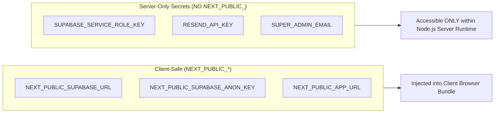

# BaseOps Environment Variables Specification

This document defines all environment variables used by BaseOps, their security classification, injection contexts, and configuration procedures for local development and production.

---

## 1. Security Classification & Boundaries



> [!CAUTION]
> **CRITICAL RULE**: Any variable prefixed with `NEXT_PUBLIC_` is compiled into the client-side JavaScript bundle and is visible to anyone inspecting network traffic or page source.
> **NEVER prefix database administrative credentials, service-role keys, or third-party secret keys with `NEXT_PUBLIC_`.**

---

## 2. Environment Variables Matrix

| Variable Name | Required | Security Scope | Local Development Value | Production Source / Example |
| :--- | :---: | :--- | :--- | :--- |
| `NEXT_PUBLIC_SUPABASE_URL` | **Yes** | Client & Server | `http://127.0.0.1:54321` | Supabase Cloud Project URL (`https://xyz.supabase.co`) |
| `NEXT_PUBLIC_SUPABASE_ANON_KEY` | **Yes** | Client & Server | Output of `supabase start` (`sb_publishable_...`) | Supabase Cloud API Settings $\rightarrow$ `anon` / `public` key |
| `SUPABASE_SERVICE_ROLE_KEY` | **Yes** | **Server-Only Secret** | Output of `supabase start` (`sb_secret_...`) | Supabase Cloud API Settings $\rightarrow$ `service_role` key |
| `NEXT_PUBLIC_APP_URL` | **Yes** | Client & Server | `http://localhost:3000` | Canonical production domain (`https://ops.yourdomain.com`) |
| `SUPER_ADMIN_EMAIL` | Optional | Server-Only | `owner@baseops.dev` | Email address permitted to access `/admin` |
| `RESEND_API_KEY` | Optional | Server-Only Secret | Blank / Unset (Mailpit catches local mail) | Resend Dashboard API Key (`re_12345...`) |

---

## 3. Local Development (`.env.local`)

For local development, copy `.env.example` to `.env.local`:

```bash
cp .env.example .env.local
```

### Complete Local Configuration Example:
```env
NEXT_PUBLIC_SUPABASE_URL=http://127.0.0.1:54321
NEXT_PUBLIC_SUPABASE_ANON_KEY=your_local_anon_key_from_supabase_start
SUPABASE_SERVICE_ROLE_KEY=your_local_service_role_key_from_supabase_start

# Application Settings
NEXT_PUBLIC_APP_URL=http://localhost:3000
SUPER_ADMIN_EMAIL=owner@baseops.dev

# Resend (Optional locally - Inbucket handles mail at http://127.0.0.1:54324)
RESEND_API_KEY=
```

---

## 4. Production Hosting Configuration

When deploying to Vercel, AWS Amplify, Railway, or Docker:

1. Populate variables in the hosting provider's **Environment Settings** dashboard.
2. Ensure `SUPABASE_SERVICE_ROLE_KEY` and `RESEND_API_KEY` are marked as **Sensitive / Secret**.
3. Verify that `NEXT_PUBLIC_APP_URL` reflects the exact production domain with `https://`.
