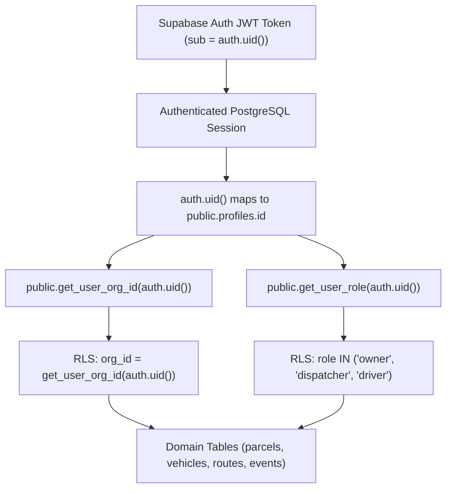

# BaseOps Security & Threat Engineering Specification

BaseOps enforces multi-tenant security, data isolation, and role boundary protection at the PostgreSQL database layer. This document provides the complete forensic specification of the security architecture, Row Level Security (RLS) policies, database triggers, search_path hardening, and adversarial attack verifications.

---

## 1. Multi-Tenant Identity & Authorization Model



### Why Database Enforcement is Required:
1. **Client-Side Vulnerabilities**: In a Single Page Application (SPA) or PWA, client JavaScript can be modified, bypassed, or inspected by attackers.
2. **API Layer Vulnerabilities**: Even with Next.js route protection, malicious callers, misconfigured server actions, or compromised tokens could attempt to supply arbitrary `org_id` values.
3. **Database-Level Guarantee**: By placing Row Level Security policies, check constraints, and `BEFORE UPDATE` triggers directly on PostgreSQL tables, unauthorized access or cross-tenant mutations are physically rejected by the database engine regardless of the client or API pathway.

---

## 2. Row Level Security (RLS) Policy Matrix

All 6 public domain tables have RLS explicitly enabled (`ALTER TABLE ... ENABLE ROW LEVEL SECURITY;`).

| Table | Policy Name | Command | Target Role | Policy Definition (`USING` / `WITH CHECK`) |
| :--- | :--- | :--- | :--- | :--- |
| **`organizations`** | `org_members_can_read_org` | `SELECT` | `authenticated` | `USING (id = public.get_user_org_id(auth.uid()))` |
| **`organizations`** | `owners_can_update_org` | `UPDATE` | `authenticated` | `USING (id = public.get_user_org_id(auth.uid()) AND public.get_user_role(auth.uid()) = 'owner')` |
| **`profiles`** | `profiles_same_org_read` | `SELECT` | `authenticated` | `USING (id = auth.uid() OR org_id = public.get_user_org_id(auth.uid()))` |
| **`profiles`** | `users_can_update_own_profile` | `UPDATE` | `authenticated` | `USING (id = auth.uid()) WITH CHECK (id = auth.uid())` *(tampering blocked by trigger)* |
| **`vehicles`** | `vehicles_org_isolation_select` | `SELECT` | `authenticated` | `USING (org_id = public.get_user_org_id(auth.uid()))` |
| **`vehicles`** | `vehicles_dispatchers_owners_insert` | `INSERT` | `authenticated` | `WITH CHECK (org_id = public.get_user_org_id(auth.uid()) AND public.get_user_role(auth.uid()) IN ('owner', 'dispatcher'))` |
| **`vehicles`** | `vehicles_dispatchers_owners_update` | `UPDATE` | `authenticated` | `USING (org_id = public.get_user_org_id(auth.uid()) AND public.get_user_role(auth.uid()) IN ('owner', 'dispatcher')) WITH CHECK (org_id = public.get_user_org_id(auth.uid()))` |
| **`vehicles`** | `vehicles_owners_delete` | `DELETE` | `authenticated` | `USING (org_id = public.get_user_org_id(auth.uid()) AND public.get_user_role(auth.uid()) = 'owner')` |
| **`parcels`** | `parcels_org_isolation_select` | `SELECT` | `authenticated` | `USING (org_id = public.get_user_org_id(auth.uid()) AND (public.get_user_role(auth.uid()) IN ('owner', 'dispatcher') OR assigned_driver_id = auth.uid()))` |
| **`parcels`** | `parcels_dispatchers_owners_insert` | `INSERT` | `authenticated` | `WITH CHECK (org_id = public.get_user_org_id(auth.uid()) AND public.get_user_role(auth.uid()) IN ('owner', 'dispatcher'))` |
| **`parcels`** | `parcels_dispatcher_owner_update` | `UPDATE` | `authenticated` | `USING (org_id = public.get_user_org_id(auth.uid()) AND public.get_user_role(auth.uid()) IN ('owner', 'dispatcher')) WITH CHECK (org_id = public.get_user_org_id(auth.uid()))` |
| **`parcels`** | `parcels_driver_status_update` | `UPDATE` | `authenticated` | `USING (org_id = public.get_user_org_id(auth.uid()) AND assigned_driver_id = auth.uid() AND public.get_user_role(auth.uid()) = 'driver') WITH CHECK (org_id = public.get_user_org_id(auth.uid()) AND assigned_driver_id = auth.uid())` |
| **`parcels`** | `parcels_owners_dispatchers_delete` | `DELETE` | `authenticated` | `USING (org_id = public.get_user_org_id(auth.uid()) AND public.get_user_role(auth.uid()) IN ('owner', 'dispatcher'))` |
| **`delivery_events`**| `delivery_events_org_read` | `SELECT` | `authenticated` | `USING (org_id = public.get_user_org_id(auth.uid()))` |
| **`delivery_events`**| `delivery_events_authenticated_insert`| `INSERT` | `authenticated` | `WITH CHECK (org_id = public.get_user_org_id(auth.uid()) AND (driver_id = auth.uid() OR driver_id IS NULL))` |
| **`delivery_events`**| `delivery_events_no_update` | `UPDATE` | `authenticated` | `USING (false)` *(Permanent Immutability)* |
| **`delivery_events`**| `delivery_events_no_delete` | `DELETE` | `authenticated` | `USING (false)` *(Permanent Immutability)* |
| **`routes`** | `routes_org_isolation_select` | `SELECT` | `authenticated` | `USING (org_id = public.get_user_org_id(auth.uid()) AND (public.get_user_role(auth.uid()) IN ('owner', 'dispatcher') OR driver_id = auth.uid()))` |
| **`routes`** | `routes_dispatchers_owners_insert` | `INSERT` | `authenticated` | `WITH CHECK (org_id = public.get_user_org_id(auth.uid()) AND public.get_user_role(auth.uid()) IN ('owner', 'dispatcher'))` |
| **`routes`** | `routes_dispatchers_owners_update` | `UPDATE` | `authenticated` | `USING (org_id = public.get_user_org_id(auth.uid()) AND public.get_user_role(auth.uid()) IN ('owner', 'dispatcher')) WITH CHECK (org_id = public.get_user_org_id(auth.uid()))` |
| **`routes`** | `routes_owners_delete` | `DELETE` | `authenticated` | `USING (org_id = public.get_user_org_id(auth.uid()) AND public.get_user_role(auth.uid()) = 'owner')` |

---

## 3. Database Security Triggers

To prevent privilege escalation, tenant takeover, or IDOR through direct SQL updates, the following PL/pgSQL triggers run `BEFORE UPDATE`:

### 3.1 Profile Protection Trigger (`trg_protect_profile_role_and_org`)
```sql
CREATE OR REPLACE FUNCTION public.protect_profile_role_and_org()
RETURNS TRIGGER
LANGUAGE plpgsql
SECURITY DEFINER
SET search_path = public, pg_temp
AS $$
BEGIN
    -- Reject user attempting to change their own role
    IF OLD.role IS DISTINCT FROM NEW.role THEN
        RAISE EXCEPTION 'Unauthorized: Role cannot be modified by user.';
    END IF;

    -- Reject user attempting to modify org_id directly
    IF OLD.org_id IS DISTINCT FROM NEW.org_id THEN
        RAISE EXCEPTION 'Unauthorized: Organization membership cannot be modified directly by user.';
    END IF;

    RETURN NEW;
END;
$$;
```

### 3.2 Entity Tenant Isolation Triggers
- **`protect_parcel_tenant_isolation()`**: `IF OLD.org_id IS DISTINCT FROM NEW.org_id THEN RAISE EXCEPTION 'Unauthorized: Parcel organization cannot be modified.'; END IF;`
- **`protect_vehicle_tenant_isolation()`**: `IF OLD.org_id IS DISTINCT FROM NEW.org_id THEN RAISE EXCEPTION 'Unauthorized: Vehicle organization cannot be modified.'; END IF;`
- **`protect_route_tenant_isolation()`**: `IF OLD.org_id IS DISTINCT FROM NEW.org_id THEN RAISE EXCEPTION 'Unauthorized: Route organization cannot be modified.'; END IF;`

---

## 4. `search_path` Hardening & Function Permissions

### 4.1 Search Path Injection Prevention (SEC-08)
When a function is marked `SECURITY DEFINER`, it runs with the privileges of the function owner (typically `postgres` or `supabase_admin`). Without an explicit search path, an attacker can create objects in a temporary schema (`pg_temp`) and hijack function execution.

BaseOps enforces explicit `SET search_path = public, pg_temp` on all `SECURITY DEFINER` routines:
- `public.get_user_org_id(UUID)`
- `public.get_user_role(UUID)`
- `public.create_organization_and_owner(TEXT, TEXT)`
- `public.protect_profile_role_and_org()`
- `public.protect_parcel_tenant_isolation()`
- `public.protect_vehicle_tenant_isolation()`
- `public.protect_route_tenant_isolation()`
- `public.set_updated_at()`

### 4.2 Permission Revocation Matrix (SEC-09)
Internal helper functions are revoked from public and anonymous access:
```sql
REVOKE EXECUTE ON FUNCTION public.get_user_org_id(UUID) FROM PUBLIC, anon;
REVOKE EXECUTE ON FUNCTION public.get_user_role(UUID) FROM PUBLIC, anon;
GRANT EXECUTE ON FUNCTION public.get_user_org_id(UUID) TO authenticated, service_role;
GRANT EXECUTE ON FUNCTION public.get_user_role(UUID) TO authenticated, service_role;
```

---

## 5. Adversarial Security Verification Suite (SEC-01 → SEC-16)

BaseOps tests every attack vector against live PostgreSQL and logic mock test harnesses:

| Test ID | Vulnerability Hypothesis | Adversarial Test Scenario | Observed Mitigation / Result | Status |
| :--- | :--- | :--- | :--- | :---: |
| **SEC-01** | Driver escalates role to owner via client UPDATE | Driver issues `UPDATE profiles SET role = 'owner'` | Blocked with exception by `trg_protect_profile_role_and_org` | 🟢 **PASS** |
| **SEC-02** | Cross-tenant parcel reads via direct ID query | Tenant A driver queries Tenant B parcel ID | RLS evaluates `org_id` match; 0 rows returned | 🟢 **PASS** |
| **SEC-03** | Cross-tenant parcel inserts | Tenant A user inserts parcel with Tenant B `org_id` | RLS `WITH CHECK` rejects insert (policy violation) | 🟢 **PASS** |
| **SEC-04** | Cross-tenant parcel mutation | Driver attempts `UPDATE` on another tenant's parcel | RLS evaluates 0 rows affected; DB trigger rejects org transfer | 🟢 **PASS** |
| **SEC-05** | Unauthorized parcel deletion | Driver attempts `DELETE FROM parcels` | RLS rejects deletion for driver role | 🟢 **PASS** |
| **SEC-06** | Tenant ID manipulation | Dispatcher alters parcel `org_id` | Blocked with exception by `trg_protect_parcel_tenant_isolation` | 🟢 **PASS** |
| **SEC-07** | Self-registration tenant takeover | Unassigned user (`org_id IS NULL`) mutates profile | Trigger rejects direct `org_id` assignment | 🟢 **PASS** |
| **SEC-08** | search_path function hijacking | Attacker manipulates session schema search order | All `SECURITY DEFINER` functions fixed to `public, pg_temp` | 🟢 **PASS** |
| **SEC-09** | Anonymous helper RPC execution | Anonymous client calls `get_user_org_id()` | `has_function_privilege = false` (Permission denied 42501) | 🟢 **PASS** |
| **SEC-10** | Vehicle tenant reassignment | Dispatcher alters vehicle `org_id` to victim org | Blocked by `trg_protect_vehicle_tenant_isolation` | 🟢 **PASS** |
| **SEC-11** | Cross-account offline cache leakage | User logs out of device | `clearLocalDatabase()` immediately wipes IndexedDB | 🟢 **PASS** |
| **SEC-12** | Driver audit event impersonation | Driver 1 logs event with Driver 2 ID | RLS `WITH CHECK (driver_id = auth.uid())` rejects row | 🟢 **PASS** |
| **SEC-13** | Route tenant reassignment | Dispatcher alters route `org_id` | Blocked by `trg_protect_route_tenant_isolation` | 🟢 **PASS** |
| **SEC-14** | Audit trail tampering | Owner updates `delivery_events` note | RLS `USING (false)` rejects mutation (0 rows affected) | 🟢 **PASS** |
| **SEC-15** | Audit trail deletion | Owner deletes `delivery_events` row | RLS `USING (false)` rejects deletion (0 rows affected) | 🟢 **PASS** |
| **SEC-16** | Unauthenticated team invite abuse | Anonymous caller hits `/api/invite-team` | Server validates session cookies; returns 401 Unauthorized | 🟢 **PASS** |

---

## 6. Verification Status Distinction

- **🟢 LOCAL VERIFIED**: All 23 live database attack tests and 38 logic tests pass against the local Docker/Supabase PostgreSQL instance (`127.0.0.1:54322`).
- **🟡 CLOUD VERIFIED**: Pending configuration of a live Supabase Cloud project by the organization owner.
