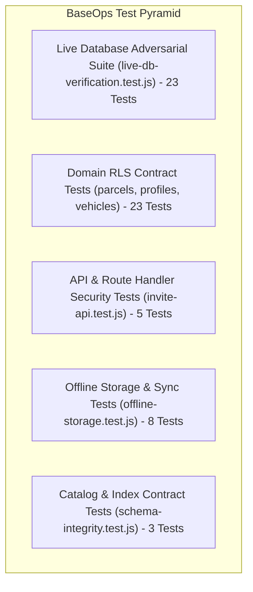

# BaseOps Testing & Verification Guide

This document outlines the testing strategy, test suite architecture, and execution procedures for BaseOps.

---

## 1. Testing Strategy & Philosophy

BaseOps enforces a multi-tier testing strategy ensuring that security guarantees and multi-tenant isolation are verified through independent, repeatable test harnesses.



---

## 2. Test Suites Directory & Inventory

All test suites are located in `tests/security/`:

### 2.1 [`tests/security/live-db-verification.test.js`](file:///c:/dev/Multi-tenancy/baseops/tests/security/live-db-verification.test.js) (23 Tests)
Direct live PostgreSQL client suite executed against `127.0.0.1:54322`:
- **Catalog Checks**: Verifies all 6 tables exist in `public`, RLS is enabled on all tables, all 17 composite indexes exist in catalog, all 9 triggers exist, and `SECURITY DEFINER` functions have explicit `search_path`.
- **Live Adversarial Attacks**: Executes simulated attacker queries with `SET LOCAL ROLE` and JWT claims (`SEC-01`, `SEC-04`, `SEC-07`, `SEC-09`, `SEC-10`, `SEC-12`, `SEC-13`).
- **Domain Constraints**: Verifies negative wallet balance rejection, duplicate plate rejection, extreme parcel weight rejection, and delivery event immutability.
- **Query Planner (EXPLAIN)**: Validates query planner index utilization for multi-tenant parcel and route queries.

### 2.2 [`tests/security/invite-api.test.js`](file:///c:/dev/Multi-tenancy/baseops/tests/security/invite-api.test.js) (5 Tests)
- Enforces authentication requirement on `/api/invite-team`.
- Enforces caller organization context.
- Rejects driver role attempting to invite members.
- Rejects dispatcher role attempting to invite owners.
- Rejects cross-tenant invitation attempts.

### 2.3 [`tests/security/offline-storage.test.js`](file:///c:/dev/Multi-tenancy/baseops/tests/security/offline-storage.test.js) (8 Tests)
- Validates Dexie.js table schema definitions.
- Validates FIFO queue ordering.
- Tests optimistic local mutations and non-destructive server state reconciliation.
- Verifies centralized logout cleanup (`clearLocalDatabase()`).

### 2.4 [`tests/security/parcels-rls.test.js`](file:///c:/dev/Multi-tenancy/baseops/tests/security/parcels-rls.test.js) (10 Tests)
- Rejects cross-tenant parcel read/write.
- Restricts driver mutations exclusively to their assigned parcels.
- Rejects driver attempt to modify parcel `org_id` or reassign to another driver.
- Rejects driver parcel deletion while permitting dispatcher deletion.

### 2.5 [`tests/security/profiles-rls.test.js`](file:///c:/dev/Multi-tenancy/baseops/tests/security/profiles-rls.test.js) (7 Tests)
- Rejects driver role escalation (`role = 'owner'`).
- Rejects driver tenant hijacking (`org_id = victimOrg`).
- Rejects unassigned user direct self-assignment to existing organizations (SEC-07).
- Verifies legitimate atomic onboarding through `create_organization_and_owner` RPC.

### 2.6 [`tests/security/vehicles-rls.test.js`](file:///c:/dev/Multi-tenancy/baseops/tests/security/vehicles-rls.test.js) (6 Tests)
- Rejects vehicle cross-tenant transfer.
- Rejects driver attempt to alter vehicle status.
- Rejects public execution of internal helper RPC functions (`get_user_org_id`, `get_user_role`).

### 2.7 [`tests/security/schema-integrity.test.js`](file:///c:/dev/Multi-tenancy/baseops/tests/security/schema-integrity.test.js) (3 Tests)
- Verifies full foreign key index coverage.
- Verifies domain check constraint expressions.
- Verifies automated `updated_at` trigger attachments.

---

## 3. Running the Test Suites

```bash
# 1. Run all unit and security logic test suites (38 tests)
npm test

# 2. Run the live PostgreSQL database integration suite (23 tests)
npm run test:live

# 3. Run all test suites concurrently (61 tests total)
npm run test:all
```

---

## 4. TypeScript & Production Build Verification

To guarantee code quality and zero build regressions:

```bash
# Type-check entire TypeScript codebase
npx tsc --noEmit

# Execute Next.js 16 production build & route pre-rendering
npm run build
```
